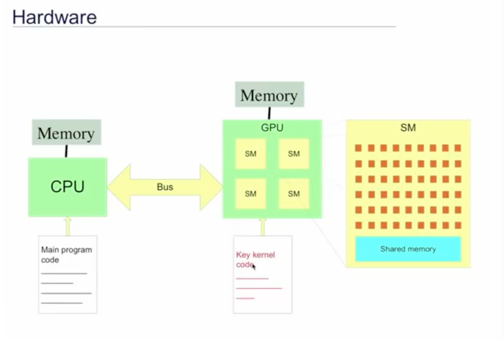

# Learning CUDA and PyCUDA

## 1. CUDA
- [*Learn CUDA in an Afternoon* tutorial](www.epcc.ed.ac.uk/online-training/learnCUDA)
    - To get the template files: `wget https://agray3.github.io/files/learnCUDA.tar.gz` (download to a machine with CUDA-enabled NVIDIA GPU)
        + `tar zxvf learnCUDA.tar.gz`
        + `cd learnCUDA`

## Introduction
- Why GPUs?
    + more silicon dedicated to computation -> many more cores in GPU than CPU
    + GDRAM higher bandwith than DRAM memory used by CPUs
- GPUs must be used in combo with CPUs
    + GPUs can't run an operating system
    + GPUs are used to handle the computationally demanding sections of code (prepared for GPU processing in **key computational *kernels***)
    + the kernels are decomposed to **run in parallel on multiple cores** on the GPU
- GPU and CPU have seperate memory space, so you need to manage these data spaces and copy data as required (they're connected via a **bus**, the **PCI express bus**)

- **Why CUDA?**
    + Traditional programming languages not sufficient for programming GPUs
    + CUDA is an extension of C/C++ to program NVIDIA GPUs
        * define kernels
        * API functions to manage memory spaces
- **Stream computing**:
    + Instead of running a loop over your dataset and perform the same operation on each element (in a single **thread**), you run many many threads at the same time, since multiple cores can process multiple elements in parallel (the computation is defined with a **kernel**).
    + Suitable for running the same operation on many data elements (i.e. **data-parallel problems**)



- 2-level hierarchy for NVIDIA GPUs: multiple **Streaming Multiprocessors (SMs)**, each with multiple **cores**
    + Each SM also has **shared memory** on board
    + number of SMs and cores is different per generation. In our code we can account for this so that our code performs well and benefits from the faster GPUs while still being compatible on older GPUs
- in CUDA:
    + **blocks** map onto **SMs**
    + **threads** map onto **cores**
    + We don't need to know exactly how many SMs and cores per SM: we **oversubscribe** and the system will handle the scheduling automatically: use **more blocks than SMs** and **more threads than cores**
- **CUDA `dim3` data type**:
    + collection of 3 integers, corresponding to x, y and z directions
    + declare with `dim3 my_xyz_values(xvalue, yvalue, zvalue);`
    + then access with `my_xyz_values.x` etc.

### Example code ("Hotel CUDA")
- The hotel is half-full, and you want everyone to be re-assigned to a new room, to have an empty room in between each occupied room.
- Serial solution: run a loop over our data structure

```c
// our loopty loop
for (i=0; i<N; i++) {
    result[i] = i*2;
}
```

- Each operation is independent of the previous operation, therefore it's possible to parallelize it instead:
    + We use a thread index instead of the loop index
    + specify the `__global__` function to form a GPU kernel
    + `threadIdx.x` is unique for each thread in a block
    + `threadIdx` is a `dim3` type, and we're only using the 1 dimension `x` for now

```c
// our kernel
__global__ void myKernel(int *result) {
    int i = threadIdx.x;
    result[i] = 2*i;
}
```

- Notice that in this and the following examples, we're not returning the calculated value, we're writing it directly to memory, via a pointer we pass as an argument to the function.
- We can launch the kernel by calling the function this way:

```c
// define how we want to decompose the kernel over blocks and threads
dim3 blocksPerGrid(1, 1, 1);   // use only one block
dim3 threadsPerBlock(N, 1, 1); // use N threads in the block

// calling the kernel function
myKernel<<<blocksPerGrid, threadsPerBlock>>>(result);
```

- in this example we only used a single block, so very poor performance!
- in practice we need to use multiple blocks, and let's say we use 256 threads per block:

```c
// our new kernel
__global__ void myKernel(int *result) {
    int i = blockIdx.x * blockDim.x + threadIdx.x; // new definition of i
    result[i] = 2*i;
}

// decomposing the kernel over blocks and threads
dim3 blocksPerGrid(N/256, 1, 1);    // assuming N is a multiple of 256
dim3 threadsPerBlock(256, 1, 1);    // use 256 threads per block

// calling the kernel function
myKernel<<<blocksPerGrid, threadsPerBlock>>>(result);
```

- For our global index *i*, we can no longer use only the `threadIdx.x`, since the `threadIdx.x` is only unique within a block. Since we're now using multiple blocks, we also need to use the block index `blockIdx.x`
- And we also need to know how many threads we have in a block, `blockDim.x`, to come up with our unique index number.

### Example code: vector addition (1D)

```c
__global__ void vectorAdd(float *a, float *b, float *c) {
    int i = blockIdx.x * blockDim.x + threadIdx.x;
    c[i] = a[i] + b[i];
}

dim3 blocksPerGrid(N/256, 1, 1);
dim3 threadsPerBlock(256, 1, 1);

vectorAdd<<<blocksPerGrid, threadsPerBlock>>>(a, b, c);
```

- CUDA C Internal variables
    + For a 1D decomposition like the examples above:
        * `blockDim.x`: number of threads per block
            - (value 256 in the above example)
        * `threadIdx.x`: thread index unique to each thread in a block
            - (ranges from 0 to 255 in the example)
        * `blockIdx.x`: block index unique to each block in the grid
            - (ranges from 0 to (N/256 - 1) in the example)

### Example code: matrix addition (2D)

```c
__global__ void matrixAdd(float a[N][N], float b[N][N], float c[N][N]) {
   int j = blockIdx.x * blockDim.x + threadIdx.x;
   int i = blockIdx.y * blockDim.y + threadIdx.y;
   // careful! we are mapping x to j and y to i. More about that later (see: memory coalescing)

   c[i][j] = a[i][j] + b[i][j];
}

int main() {
    dim3 blocksPerGrid(N/16, N/16, 1);  // (N/16) * (N/16) blocks per grid (2D)
    dim3 threadsPerBlock(16, 16, 1);    // 16 * 16 = 256 threads per block (2D)

    matrixAdd<<<blocksPerGrid, threadsPerBlock>>>(a, b, c);
}
```

### Memory Management

#### Allocation (`cudaMalloc`)
- GPU has separate memory management from host CPU, and the data accessed in the kernels must be stored in GPU memory
- explicitly manage GPU memory, and copy data to and from it
    + `cudaMalloc` to allocate memory
    + `cudaFree` to release it

```c
float *a;
cudaMalloc(&a, N*sizeof(float)); // &a passing the address of the pointer

cudaFree(a);
```

#### Copy data (`cudaMemcpy`)
- After allocating GPU memory, we copy data to and from it (between **host** and **device** memory, meaning CPU and GPU memory respectively)

```c
cudaMemcpy(array_device, array_host, N*sizeof(float), cudaMemcpyHostToDevice);
cudaMemcpy(array_host, array_device, N*sizeof(float), cudaMemcpyDeviceToHost);
```

- First argument is always the **destination** of the transfer, second is the **source** of the transfer
- Transfer back and forth between CPU and GPU is a potential bottleneck so minimize this as much as possible!

### Synchronization between host and device
- Kernel calls are **non-blocking**, so host program continues right after calling the kernel, running the main thread on CPU while letting the GPU finish
- to wait for the kernel to finish, you need to use `cudaThreadSynchronize()`

```c
vectorAdd<<<blocksPerGrid, threadsPerBlock>>>(a, b, c);
// do work on host that doesn't depend on c
cudaThreadSynchronize(); // wait for kernel to finish
```

- Good practice to run `cudaThreadSynchronize` to avoid bugs in your program
- `cudaMemcpy` calls are **blocking** (but there are non-blocking ways, check the docs)
- Within a kernel and **between threads in the same block** you can synchronize with the `syncthreads()` call. Threads in the same block can communicate through **shared memory space** (physically located on the SM, the *streaming multiprocessor* if you remember from earlier, see the schematic)
    + example where each thread has a *local x* and the block has an *array* in shared memory space:

    ```c
    if (threadIdx.x == 0) array[0] = x;
    syncthreads(); // wait until operation on first thread is completed
    if (threadIdx.x == 1) x = array[0];
    ```

- different blocks **can't communicate**; you'll need to exit the kernel and start a new one from the CPU

## GPU Optimization

- main bottlenecks:
    + copying data host <> device (over the PCI express bus)
    + underutilization of the GPU: exposing parallelism and memory latency
    + GPU memory bandwith
    + branching within code

### Copying host <> device
- keep data resident on the device for as long as possible during the computation
    + so you may want to port more routines or calculate data from scratch on the device to avoid an extra CPU step
- Example in pseudocode: 

```
Loop over timesteps
    inexpensive_routine_on_host(data_on_host)
    copy data from host to device
    expensive_routine_on_device(data_on_device)
    copy data from device to host
End loop over timesteps
```

This is called *data sloshing*, moving data back and forth like that. Instead, port the inexpensive routine to the device and move data copies outside of the loop:

```
Copy data from host to device
Loop over timesteps
    inexpensive_routine_on_device(data_on_device)
    expensive_routine_on_device(data_on_device)
End loop over timesteps
Copy data from device to host
```

### Parallelism and memory latency

### GPU memory bandwith

### Code branching


## 2. PyCUDA

