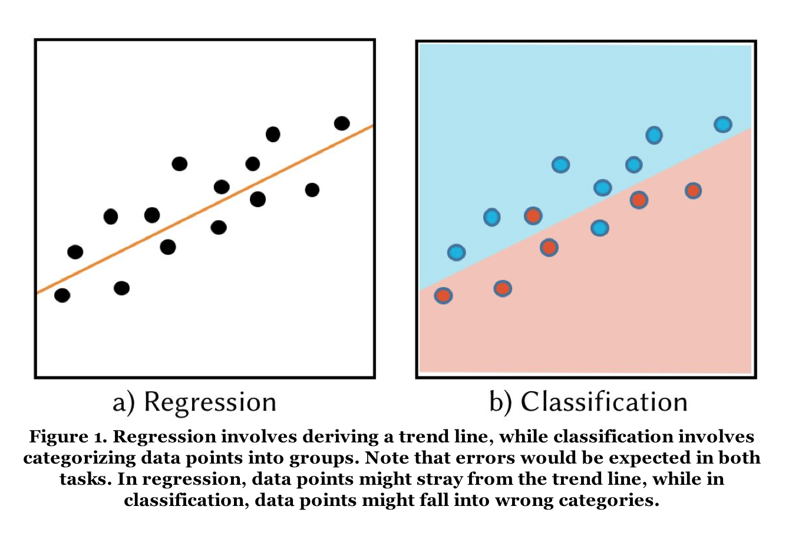
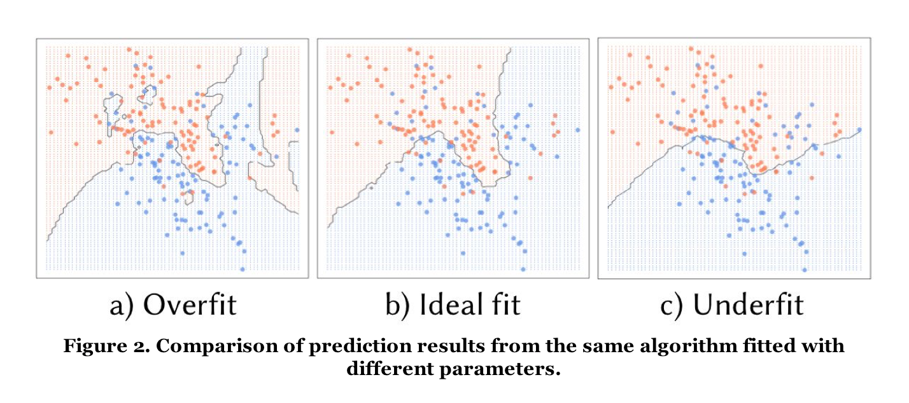
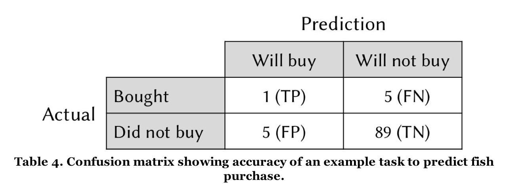
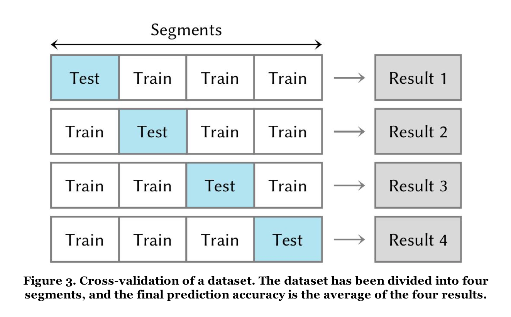

# Numsense! Data Science for the Layman: No Math Added - Annalyn Ng, Kenneth Soo

## 1. Basics in a Nutshell

- Four key steps in data science study:
    + Prepare the data (1.1)
    + Select algorithms to model the data (1.2)
    + Tune algorithm parameters to optimize the models (1.3)
    + Evaluate models based on their accuracy (1.4)

### 1.1 Data Preparation

#### Data Format
- Tables
    + rows: the *data points*
        * we can change the type of observations represented by each row (e.g. aggregate all data points by day) 
    + columns: the *variables* (or *attributes, features, dimensions*)
        * we can add new variables from another data source

#### Variable types
- 4 main types:
    + Binary (only 2 possible options)
    + Categorical variable (categories)
    + Integer (discrete number)
    + Continuous (number with decimal places)

#### Variable selection
- too many variables add noise or slow down computation -> we need to select the most relevant variables
    + start using simple plots to examine correlations between variables

#### Feature engineering
- engineering variables
    + e.g. grouping categories into broader categories
    + e.g. *dimension reduction*, combining multiple variables to reduce the set of variables for analysis

#### Missing data
- can interfere with analysis -> potential solutions
    + **Approximated:**
        * if *binary* or *categorical* variable type: replace with the *mode* (most common value of that variable)
        * if *integer* or *continuous values*: use the *median*
    + **Computed:**
        * using algorithms under supervised learning
    + **Removed:**
        * last resort: remove the rows with missing data
        * (-) reduces amount of data
        * (-) skews the data sample toward/away from particular groups (-> under- or over-represented groups)

### 1.2 Algorithm Selection
- choice of algorithm depends on the task to perform
- 3 categories of algorithms
    + **Unsupervised learning**
        * *k*-means clustering
        * Principal component analysis
        * Association rules
        * Social network analysis
    + **Supervised learning**
        * Regression analysis
        * *k*-nearest neighbours
        * Support vector machine
        * Decision tree
        * Random forests
        * Neural networks
    + **Reinforcement learning**
        * Multi-armed bandits

#### Unsupervised learning
- *Task: Tell me what patterns exist in my data*
- **Unsupervised**: we don't know what patterns to look out for
- Validate results *indirectly*, e.g. if generated clusters correspond to familiar categories

#### Supervised learning
- *Task: Use the patterns in my data to make predictions*
- **Supervised**: we want the predictions to be based on pre-existing patterns
    + the *prediction* is based on the *predictor variables*
- Validate results *directly* by checking how close the predictions are to actual values.
- Types of problems:
    + **Regression problems**: predicting integers or continuous values
        * result is a trend line
    + **Classification problem**: predicting binary or categorical values
        * can also generate predictions as a continuous probability value (e.g. *75% chance of rain*)
        * result is groups of data points

    

#### Reinforcement learning
- *Task: Use the patterns in my data to make predictions, and improve these predictions as more results come in*
- **Reinforcement**: the model continuously improves itself using feedback from results

### 1.3 Parameter Tuning
- Parameters are options used to tweak an algorithms settings
- Affects the **sensitivity** of the algorithm
    + ***Overfitting***: highly accurate for the current data but less generalisable for future data
        * -> too sensitive
    + ***Underfitting***: the model overlooks underlying patterns, trends, resulting in less accurate predictions
        * -> too insensitive
    + **Tuned just right**: balance between identifying major trends and discounting minor variations

    

- **Regularisation**: adding a new penalty parameter
    + penalizes any increase in a model's complexity by artificially inflating prediction error
    + limits tendency to *increase complexity* of a model, which would result in overfitting

### 1.4 Evaluating Results
- 3 frequently used evaluation metrics
    + ***Classification metrics***
        * 1) **Percentage of correct predictions**
            - Proportion of predictions that proved to be correct.
            - (-) does not inform us where prediction errors occur
        * 2) **Confusion matrix**
            - (+) gives insight where the model succeeded, but also failed (false positives (FP) vs false negatives (FN))
            - In the case of earthquakes for example, false negatives would be much costlier than false positives.

    

    + ***Regression metric***
        * 3) **Root mean squared error (RMSE)**
            - Regression predictions use continuous values (on a line, or curve). Errors are the differences between predicted and actual values.
            - To penalize outliers, and to avoid large errors, we can square each individual error to amplify large errors. 

- **Validation**
    + *Validation:* assessment of how accurate a model is in predicting new data
    + How?
        * Split dataset into **training dataset** and **test or validation dataset**
            - Needs to be randomized without bias
        * **Cross-validation:** If the dataset is too small to split, we can divide the dataset into several segments that are used to test the model iteratively. In each iteration, the whole dataset except one segment is used as the *training set*, and the remaining segment as the *validation set*. Each segment will then have been used as validation set exactly once.

    

## 2. *k-*Means Clustering

## 3. Principal Component Analysis

## 4. Association Rules

## 5. Social Network Analysis

## 6. Regression Analysis

## 7. *k-*Nearest Neighbors and Anomaly Detection

## 8. Support Vector Machine

## 9. Decision Tree

## 10. Random Forests

## 11. Neural Networks

## 12. A/B Testing and Multi-Armed Bandits

